# day29 ServletContext和Response

```java
***	记得东西太多，到做案例时什么都没记到，一脸茫然 好烦
***	案例讲的太快了
***	1，老师，当做比较复杂的案例时能先分析好，再做题吗，一次讲完全部步骤，听得很懵 2，有时候比较难理解的内容时可以用个比喻的方式吗？这样也比较容易理解

***	老师后面案列,说得稍微有点快,可能是因为时间的原因吧,拖堂都拖了,也不急着那一下嘛,就是用到前面某个知识点的时候,复制粘贴过来的时候能不能给一点时间大概思考一下,或者简单的提点一下,不然一下有点反应不过来的感觉.
    
***	一入黑马深似海 从此红尘是路人
***	不是我吹，我半年后出去月薪肯定 3000
***	慢慢 慢慢 慢慢 慢点
***	那个跳转广告页面的案例，用转发的话，getRequestDispatcher(" adv.html ")里的地址，写不写 "/" 都行咯？

***	前面的知识忘了，后面的又记不住
---	防盗链为什么不直接使用URL?使用URI的话,自己做一个相同URI的网页做跳转就可以绕过广告了
```

# 学习目标

- [ ] 能够使用使用浏览器开发工具查看响应
- [ ] 能够理解响应行（状态行）的内容 

```java
协议版本  状态码  状态描述
```

- [ ] 能够理解常见的状态码

```
200 
404
405
302
304
500 
```

- [ ] 能够使用Response 对象操作HTTP 响应内容

```
OutputStream getOutputStream(); 
PrintWriter getWriter()
```

- [ ] 能够处理响应乱码

```
response.setContentType("text/html;charset=utf-8");
```

- [ ] 能够完成文件下载案例

```
设置响应头：content-disposition  attachment;filename=文件名;
```

- [ ] 能够使用ServletContext 域对象

```
1. 全局共享数据
2. 读取web文件夹下资源文件
```

# 第1节 HTTP响应概述

## 1.1 什么是HTTP响应

- 服务器端发送给客户端的数据则称为响应。

## 1.2 响应信息的组成

- 响应行
- 响应头
- 响应体

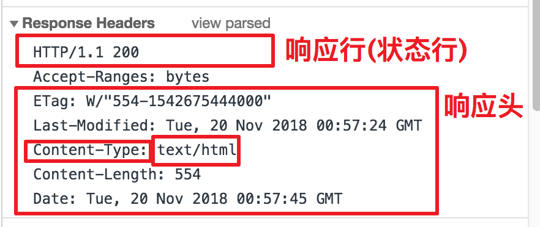

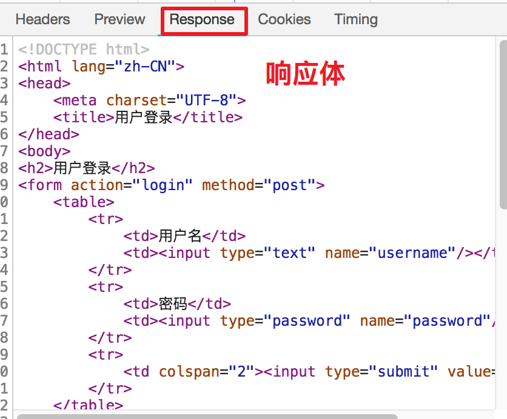

### 1.2.1 响应行

```java
格式：HTTP/1.1 200 OK
组成：协议和版本  状态码  状态描述
```

#### 1.2.1.1 常见状态码的含义

| **状态码** | **含义**                                                     |
| ---------- | ------------------------------------------------------------ |
| **200**    | 正确响应，没有问题                                           |
| **302**    | 表示重定向                                                   |
| **304**    | 表示浏览器使用本地缓存                                       |
| **404**    | 客户端请求的资源在服务器端不存在                             |
| **405**    | 如果浏览器是GET或POST请求，而Servlet没有重写doGet或doPost方法时出现的问题 |
| **500**    | 服务器端代码有异常                                           |

### 1.2.2 响应头

- 一组键和值组成信息

| **响应头信息**                                              | **说明**                                                     |
| ----------------------------------------------------------- | ------------------------------------------------------------ |
| **Location:** http://www.itcast.cn                          | 指定重定向的地址，要结合状态码302一起使用                    |
| **Server:apache   tomcat**                                  | 服务器名称                                                   |
| **Content-Encoding: gzip**                                  | 服务器对内容使用的压缩格式                                   |
| **Content-Length:   80**                                    | 服务器返回内容的长度：单位字节                               |
| **Content-Type:   text/html; charset=utf-8**(重点)          | 设置响应内容的类型和编码                                     |
| **Refresh:   1;url=/day29/hello.html**(重点)                | 在1秒后跳转到指定页面                                        |
| **Content-Disposition: attachment; filename=abc.zip**(重点) | Content-Disposition：内容的处理方式<br>attachment：附件方式<br>filename=abc  文件名 |

### 1.2.3 响应体

```java
响应体：服务器返回给浏览器显示的内容
如果内容是文字，则显示就是文字，如果是图片，视频，音频，显示的二进制数据。
```

# 第2节 response设置响应行

## 2.1 HttpServletResponse对象概述

```java
响应对象 response 是一个HttpServletResponse接口实现类对象，用来封装服务器返回浏览器的所有数据：响应行，响应头，响应体
```

## 2.2 设置状态码的方法

| 方法                           | 描述               |
| ------------------------------ | ------------------ |
| **void setStatus(int status)** | 设置响应行的状态码 |

> 注意：单独设置状态码是没有意义，一般会结合功能设置。

## 2.3 常见状态码示例

### 2.3.1 404状态码

- 404的含义：`请求资源不存在`
- 常见404错误的原因

| **404** **常见的情况** | **描述**                                                     |
| ---------------------- | ------------------------------------------------------------ |
| **地址栏错误**         | 浏览器地址栏地址写错了，区分大小写                           |
| **web.xml配置问题**    | 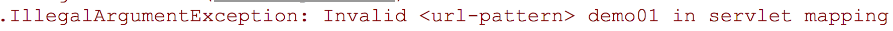配置文件中的映射路径不正确，会导致整个项目中的资源无法访问 |
| **访问** **WEB-INF**   | 在WEB-INF文件夹下的资源是受保护：不能直接通过浏览器访问的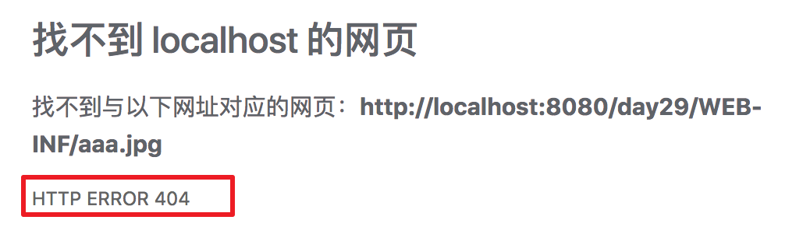 |

### 2.3.2 405状态码

- 405错误的原因：`如果浏览器是GET或POST请求，而Servlet没有重写doGet或doPost方法时出现的问题`
- 

# 第3节 response设置响应头

### 3.1 设置响应头的方法

| **响应头的方法**                                   | **描述**                                                     |
| -------------------------------------------------- | ------------------------------------------------------------ |
| **void setHeader(String name, String value)**      | 设置响应头键值对信息<br>参数1：响应头名称<br>参数2：响应头对应值 |
| **void setContentType(String type)** 重点          | 该方法是专门设置这个响应头的方法：content-type<br>比如：response.setContentType("text/html;charset=utf-8") 等价于：response.setHeader("content-type","text/html;charset=utf-8") |
| **void setCharacterEncoding(String charset)** 了解 | 设置打印流的编码                                             |

### 3.2 响应头方法示例01

- **需求：过3秒跳转到另一个网站**
- **步骤**

- [ ] 创建 RefreshServlet
- [ ] 调用 setHeader，设置响应头：`("Refresh","3;url=http://www.itcast.cn")`
- [ ] 调用 setStatus，设置响应状态码 200(可选)。

- **代码**

```java
// Refresh:  1;url=/day29/hello.html(重点)
@WebServlet(urlPatterns = "/refresh")
public class RefreshServlet extends HttpServlet {
    protected void doPost(HttpServletRequest request, HttpServletResponse response) throws ServletException, IOException {
        // 设置内容的类型和编码格式
        response.setContentType("text/html;charset=utf-8");
        // 获得字符打印输出流对象
        PrintWriter out = response.getWriter();
        out.write("过3秒跳转到另一个网站");

        // 设置响应头：Refresh
        // 告诉浏览器在3秒后跳转到指定的网站
        response.setHeader("Refresh", "3;url=http://ntlias3.boxuegu.com");
    }

    protected void doGet(HttpServletRequest request, HttpServletResponse response) throws ServletException, IOException {
        this.doPost(request, response);
    }
}
```

### 3.3 响应头方法示例02

- **需求：使用 location 进行页面跳转**
- **302 的含义**：`表示要重定向`
- **步骤**

- [ ] 创建 LocationServlet
- [ ] 调用 setHeader，设置响应头：`("location","http://www.itcast.cn")`
- [ ] 调用 setStatus，设置响应状态码 302

- **代码**

```java
@WebServlet(urlPatterns = "/location")
public class LocationServlet extends HttpServlet {
    protected void doPost(HttpServletRequest request, HttpServletResponse response) throws ServletException, IOException {
        // 设置内容的类型和编码格式
        response.setContentType("text/html;charset=utf-8");
        // 获得字符打印输出流对象
        PrintWriter out = response.getWriter();
        // 重定向：该行代码等价下面两行代码
        response.sendRedirect("login.html");

        // 设置响应头：location
        /*response.setHeader("location", "http://ntlias3.boxuegu.com");
        // 设置状态码：302
        response.setStatus(302);*/
    }

    protected void doGet(HttpServletRequest request, HttpServletResponse response) throws ServletException, IOException {
        this.doPost(request, response);
    }
}
```

- [ ] **面试题：**Location需要与状态码302配合使用才能完成页面的转发，这句话正确吗？

```
错误的，是重定向。
```

# 第4节 response设置响应体

## 4.1 服务器响应数据的方式

| **相关方法**                       | **描述**                                 |
| ---------------------------------- | ---------------------------------------- |
| **OutputStream getOutputStream()** | 如果响应内容是非文本数据，则使用该流输出 |
| **PrintWriter getWriter()**        | 如果响应内容是文本数据，则使用该流输出   |

## 4.2 处理响应体文本乱码

### 4.2.1 示例：演示乱码

- **需求：使用打印输出流，输出中文**

```java
// 需求：利用输出流输出数据(响应体)到浏览器
@WebServlet(urlPatterns = "/demo02")
public class Demo02TwoServlet extends HttpServlet {
  protected void doPost(HttpServletRequest request, HttpServletResponse response) throws ServletException, IOException {
        // 设置打印流编码：使用指定编码对数据进行编码
        // 注意事项：设置编码的方法必须在获取输出流对象之前执行
        // response.setCharacterEncoding("utf-8");

        // 设置响应头：content-type 告诉浏览器服务器返回数据的类型和使用编码
        // 该行代码实现两个功能：1：设置打印流的编码 2.告诉浏览器使用指定编码解析内容
        // response.setHeader("content-type", "text/html;charset=utf-8");
        response.setContentType("text/html;charset=utf-8");

        // 获得字符打印输出流对象
        PrintWriter out = response.getWriter();

        out.write("hello world");
        out.write("你好 师姐");
    }

    protected void doGet(HttpServletRequest request, HttpServletResponse response) throws ServletException, IOException {
        this.doPost(request, response);
    }
}
```

### 4.2.2 中文乱码原因

- 因为Tomcat服务器使用码表是欧洲码表：iso-8859-1，因为该没有中文，如果输出的内容有中文，则会乱码

### 4.2.3 设置打印流字符集

| 响应对象的方法                           | 作用             |
| ---------------------------------------- | ---------------- |
| void setCharacterEncoding("utf-8"); 了解 | 设置打印流的编码 |

### 4.2.4 设置ContentType的作用

| ContentType的作用                 |
| --------------------------------- |
| 1. 设置打印流的编码               |
| 2. 告诉浏览器使用指定编码解析内容 |

> 注意事项：设置编码的方法必须在获取输出流对象之前执行

# 第5节 ServletContext上下文对象

## 5.1 什么是ServletContext

- 概念：一个web应用就对应一个上下文，一个ServletContext对象就是代表一个web应用程序。

> 如何理解所谓的 “上下文”。
>
> 每个Web项目，运行时部署在Web应用服务器(如Tomcat)下，我们称之为一个应用(Application)。我们知道一个Web应用里可以有多个Servlet，而这里的Servlet上下文就可以理解为这些Servlet的运行环境。
>
> 形象地说：如果把数据比作鱼，Servlet比作鸭子，那么所谓的Servlet上下文就是湖水或者湖
>
> 
>
> 如果现在有一份数据需要传给所有的Servlet使用，那么我们就可以使用ServletContext对象了。就像某只鸭子(Servlet)肚子里的鱼(数据)是没办法共享给另一只鸭子的，可是放在湖里的鱼，至少每个鸭子都可以去咀一口，这里的湖就是ServletContext了。

- 作用

```
1. 读取web文件夹下面的资源
2. 用于多个Servlet之间共享数据
```

## 5.2 如何得到ServletContext

| ServletConfig接口中方法                | 描述           |
| -------------------------------------- | -------------- |
| **ServletContext getServletContext()** | 获得上下文对象 |

- 回顾Servlet的继承结构

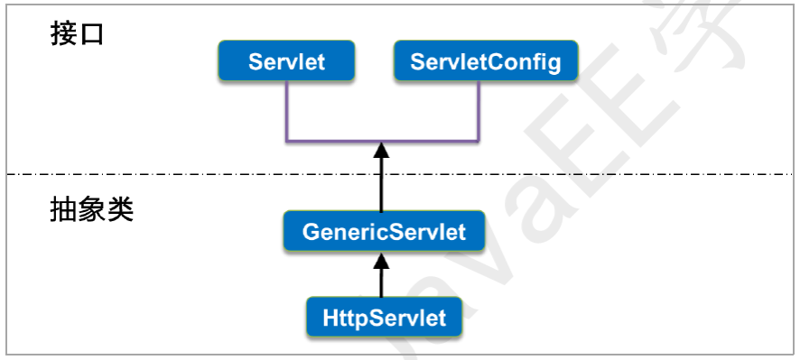

## 5.3 读取项目的资源文件

### 5.3.1 相关方法

| **ServletContext** **的方法**                    | **功能**                                                     |
| ------------------------------------------------ | ------------------------------------------------------------ |
| **InputStream getResourceAsStream(String path)** | 根据资源文件路径获得对应字节输入流<br>默认从web文件夹下查找资源文件 |
| **String getRealPath(String path)**              | 获得资源文件部署到服务器上真实路径                           |

### 5.3.2 WEB-INF下的资源访问

- 需求：读取WEB-INF下面的图片文件显示在浏览器上
- 效果


- 代码

```java
// 需求：读取WEB-INF文件夹下aaa.jpg图片显示在浏览器上
@WebServlet(urlPatterns = "/image")
public class LoadResourceFormWebServlet extends HttpServlet {
    protected void doPost(HttpServletRequest request, HttpServletResponse response) throws ServletException, IOException {
        // 可选：设置响应内容格式
        response.setHeader("content-type","image/jpg");
        // 获得上下文对象
        ServletContext context = getServletContext();
        // 获得资源文件对应字节输入流：in
        InputStream in = context.getResourceAsStream("/WEB-INF/aaa.jpg");
        // 获得字节输出流对象
        ServletOutputStream out = response.getOutputStream();
        // 定义字节数组存储读取到的图片数据
        byte[] buf = new byte[1024];
        // 定义整型数据接收读取到的字节个数
        int len = -1;
        // 循环读写数据
        while ((len = in.read(buf)) !=-1){
            // 通过out将图片数据输出到浏览器
            out.write(buf, 0, len);
        }
    }

    protected void doGet(HttpServletRequest request, HttpServletResponse response) throws ServletException, IOException {
        this.doPost(request, response);
    }
}
```

## 5.4 使用上下文域共享数据

### 5.4.1 在Servlet之间共享数据

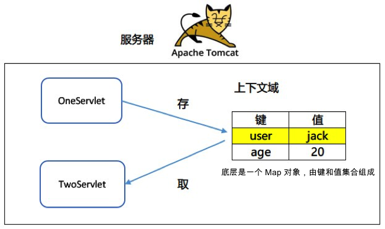

### 5.4.2 上下文域的作用范围

```java
跟随web容器的关闭而销毁(整个web应用的运行过程都有效)
```

### 5.4.3 上下文域相关方法

| **ServeltContext** **的方法**            | **作用**                     |
| ---------------------------------------- | ---------------------------- |
| **void setAttribute("键","Object数据")** | 存储键值对到上下文域中       |
| **Object getAttribute("键")**            | 从上下文域中根据键获得值     |
| **void   removeAttribute("键")**         | 根据键从上下文域中删除键值对 |

### 5.4.4 案例：统计用户登录数量

#### 5.4.4.1 实现原理

- 每个用户先从上下文域中取出数据，如果没有数据表示第1个用户。如果有数据加1，更新上下文域的内容。

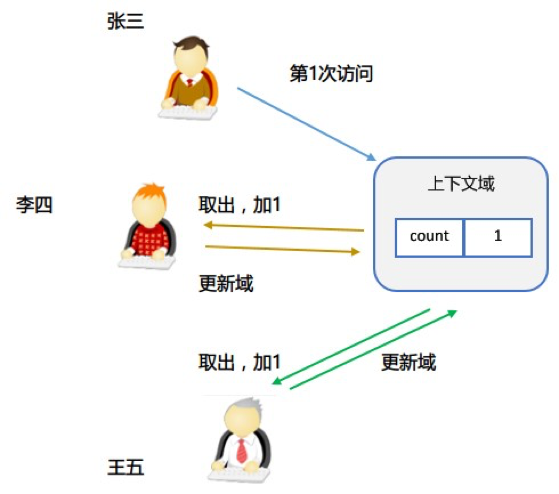

#### 5.4.4.2 实现过程

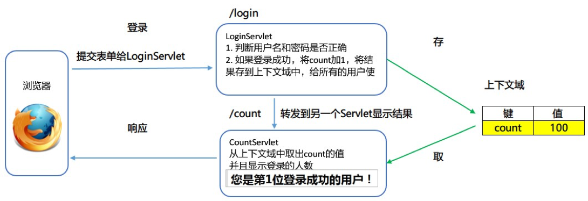

#### 5.4.4.3 实现步骤

- [ ] 在LoginServlet的init()方法中创建count=0，并且将值放入上下文域中.
- [ ] 在登录成功的代码中从上下文域中取出 count并且加 1，再更新上下文域中的值。
- [ ] 登录成功：跳转到另一个CountServlet，在另一个 CountServlet 中取出上下文域中的值，显示在页面上。
- [ ] 登录失败：提示"**用户名或密码错误**"，并跳转到登录界面

#### 5.4.4.4 案例代码

- 登录表单代码

```html
<!DOCTYPE html>
<html lang="zh_CN">
<head>
    <meta charset="UTF-8">
    <title>登录页面</title>
</head>
<body>
<!--online 是一个 servlet-->
<h2>用户登录</h2>
<form action="online" method="post">
    用户名：
    <input type="text" name="username"><br/>
    密码：
    <input type="password" name="password"><br/>
    <input type="submit" value="登录">
</form>
</body>
</html>
```

- OnlineServlet

```java
/*
    需求：统计在线人数

    步骤分析
        1. 接收用户名和密码
        2. 判断用户名是否为admin和密码是否为123
        3. 如果是，则登录成功，
            * 先从上下文域中根据count获得当前在线人数
            * 如果count为null，则表示第一个登录，往上下文域中存储一个键值对：count:1
            * 如果count不为null，则获得count值加一，再存储到上下文域中：count：count+1
            * 则跳转到另一个页面：显示在线人数
       4. 如果不是，则登录失败，则提示用户名或密码错误，3秒都跳转登录页面
 */
@WebServlet(urlPatterns = "/online")
public class OnlineServlet extends HttpServlet {
   protected void doPost(HttpServletRequest request, HttpServletResponse response) throws ServletException, IOException {
       // 1. 接收用户名和密码
       String username = request.getParameter("username");
       String password = request.getParameter("password");
       // 获得上下文域对象
       ServletContext context = getServletContext();
       // 2. 判断用户名是否为admin和密码是否为123
       if("admin".equals(username) && "123".equals(password)){
           // 3. 如果是，则登录成功，
           // 先从上下文域中根据count获得当前在线人数
           Integer count = (Integer)context.getAttribute("count");
           if (count == null) {
               // 如果count为null，则表示第一个登录
               count = 1;
           } else {
                // 如果count不为null，则获得count值加一
                count++;
           }
           // 存储count到上下文域中
           context.setAttribute("count", count);
           // 则跳转到另一个页面：显示在线人数
            request.getRequestDispatcher("count").forward(request, response);
       } else {
           // 4. 如果不是，则登录失败，则提示用户名或密码错误，3秒都跳转登录页面
           response.sendRedirect(request.getContextPath()+"/fail");
       }
    }

    protected void doGet(HttpServletRequest request, HttpServletResponse response) throws ServletException, IOException {
        this.doPost(request, response);
    }
}
```

- CountServlet

```java
// 显示在线人数
@WebServlet(urlPatterns = "/count")
public class ConutServlet extends HttpServlet {
    protected void doPost(HttpServletRequest request, HttpServletResponse response) throws ServletException, IOException {
        // 获得上下域对象
        ServletContext context = getServletContext();
        // 根据count获得在线人数
        Object count = context.getAttribute("count");
        // 设置内容的类型和编码格式
        response.setContentType("text/html;charset=utf-8");
        // 获得字符打印输出流对象
        PrintWriter out = response.getWriter();
        out.write("当前在线人数：" + count);
    }

    protected void doGet(HttpServletRequest request, HttpServletResponse response) throws ServletException, IOException {
        this.doPost(request, response);
    }
}
```

# 第6节 下载Web资源

| Content-Disposition: attachment; filename=abc.zip**(重点) | Content-Disposition：内容的处理方式<br>attachment：附件方式<br>filename=abc  文件名 |
| --------------------------------------------------------- | ------------------------------------------------------------ |
|                                                           |                                                              |


## 6.1 需求：实现不同类型的文件下载

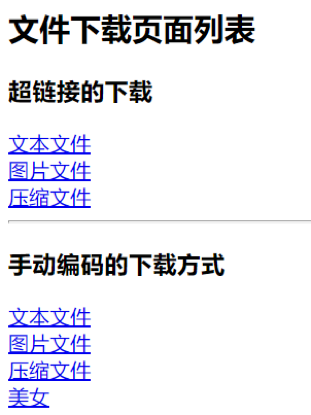

## 6.2 下载页面代码

```html
<!DOCTYPE html>
<html>
<head>
    <title>资源下载列表</title>
    <meta charset="utf-8">
</head>
<body>
<h2>文件下载页面列表</h2>
<h3>超链接的下载</h3>
<a href="download/file.txt">文本文件</a><br/>
<a href="download/file.jpg">图片文件</a><br/>
<a href="download/file.zip">压缩文件</a><br/>
<hr/>
<h3>手动编码的下载方式</h3>
<a href="down?filename=file.txt">文本文件</a><br/>
<a href="down?filename=file.jpg">图片文件</a><br/>
<a href="down?filename=file.zip">压缩文件</a><br/>
<a href="down?filename=美女.jpg">美女</a><br/>
</body>
</html>
```

## 6.3 使用超链接下载

### 6.3.1 存在的不足

```java
1. 有些文件是直接在浏览器中显示内容了，并不是下载到本地。
2. 文件地址直接暴露在地址栏上，容易被盗链
3. 无法处理业务逻辑，比如抵扣积分。
```

## 6.4 使用Servlet下载

### 6.4.1 实现步骤

1. 从链接上得到文件名
2. 设置 content-disposition 头
3. 得到文件的输入流
4. 得到 response 的输出流
5. 写出到浏览器端

### 6.4.2 下载Servlet代码

```java
/**
 Servlet实现下载功能：中文存在乱码问题
 */
@WebServlet(urlPatterns = "/down02")
public class DownloadServlet02 extends HttpServlet {
    @Override
    protected void doGet(HttpServletRequest request, HttpServletResponse response) throws ServletException, IOException {
        // 1. 从链接上得到文件名
        String fileName = request.getParameter("filename");
        System.out.println(fileName);
        // 2. 设置 content-disposition 头
        response.setHeader("Content-Disposition", "attachment;filename="+fileName);
        // 3. 得到文件的输入流
        InputStream in = getServletContext().getResourceAsStream("/download/"+fileName);
        // 4. 得到 response 的输出流
        OutputStream out = response.getOutputStream();
        // 5. 写出到浏览器端

        // 定义字节数组存储读取到的图片数据
        byte[] buf = new byte[1024];
        // 定义整型数据接收读取到的字节个数
        int len = -1;
        // 循环读写数据
        while ((len = in.read(buf)) !=-1){
            // 通过out将图片数据输出到浏览器
            out.write(buf, 0, len);
        }
    }
}
```

## 6.5 下载文件名中文乱码问题

### 6.5.1 中文名乱码的原因

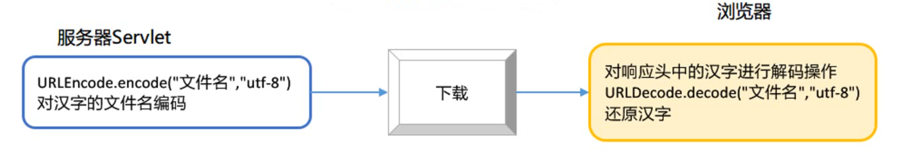

### 6.5.2 如何解决中文名乱码

- 在服务器端先对文件名进行URL编码，这样浏览器端对文件名进行URL解码就不会出现问题
- 编码和解码使用的码表要一致，浏览器默认使用UTF8对文件名进行解码。

### 6.5.3 URL编码相关方法

| 方法名                                            | **描述**              |
| ------------------------------------------------- | --------------------- |
| **java.net.URLEncoder.encode("字符串", "utf-8")** | 对字符串使用utf-8编码 |
| **java.net.URLDecoder.decode("字符串", "utf-8")** | 对字符串使用utf-8解码 |

- **演示：对汉字进行编码和解码**

```java
public class Demo01 {
    public static void main(String[] args) throws Exception {
        // 字符串
        String str = "美女";
        // 对字符串进行URL编码
        String encode = URLEncoder.encode(str, "utf-8");
        System.out.println(encode);

        // 对编码的字符串解码
        String decode = URLDecoder.decode(encode, "utf-8");
        System.out.println(decode);
    }
}
```

### 6.5.4 下载Servlet代码-无乱码

```java
@WebServlet(urlPatterns = "/down")
public class DownloadServlet extends HttpServlet {
    @Override
    protected void doGet(HttpServletRequest request, HttpServletResponse response) throws ServletException, IOException {
        // 1. 从链接上得到文件名
        String filename = request.getParameter("filename");
        // 3. 得到文件的输入流
        InputStream in = getServletContext().getResourceAsStream("/download/"+filename);

        // 获得请求头中的User-Agent
        String agent = request.getHeader("User-Agent");
        // 根据不同的客户端进行不同的编码
        if (agent.contains("MSIE")) {
            // IE浏览器
            filename = URLEncoder.encode(filename, "utf-8");
            filename = filename.replace("+", " ");
        } else if (agent.contains("Firefox")) {
            // 火狐浏览器
            filename = "=?utf-8?B?" + Base64.getEncoder().encodeToString(filename.getBytes("utf-8"))+"?=";
        } else if(agent.contains("Safari") && !agent.contains("Chrome")){
            // Safari浏览器：Chrome头也包含safari,需要排除Chrome
            byte[] bytesName = filename.getBytes("UTF-8");
            filename = new String(bytesName, "ISO-8859-1");
        } else {
            // Chrome以及其它浏览器
            filename = URLEncoder.encode(filename, "utf-8");
        }

        // 2. 设置 content-disposition 头
        response.setHeader("Content-Disposition", "attachment;filename="+ filename);

        // 4. 得到 response 的输出流
        OutputStream out = response.getOutputStream();
        // 5. 写出到浏览器端

        // 定义字节数组存储读取到的图片数据
        byte[] buf = new byte[1024];
        // 定义整型数据接收读取到的字节个数
        int len = -1;
        // 循环读写数据
        while ((len = in.read(buf)) !=-1){
            // 通过out将图片数据输出到浏览器
            out.write(buf, 0, len);
        }
    }
}
```

> 注意：浏览器会对下载文件名进行解码，不同浏览器的解码时使用的码表不一致，如果解决不同浏览器中文名乱码问题就需要在服务器端使用对应的码表先对文件名进行编码。
>
> 下面代码适配了各大浏览器的，需要使用的时候直接拷贝即可：建议文件名不要使用中文名。
>
> ```java
> // 获得请求头中的User-Agent
> String agent = request.getHeader("User-Agent");
> // 根据不同的客户端进行不同的编码
> if (agent.contains("MSIE")) {
>     // IE浏览器
>     filename = URLEncoder.encode(filename, "utf-8");
>     filename = filename.replace("+", " ");
> } else if (agent.contains("Firefox")) {
>     // 火狐浏览器
>     filename = "=?utf-8?B?" + Base64.getEncoder().encodeToString(filename.getBytes("utf-8"))+"?=";
> } else if(agent.contains("Safari") && !agent.contains("Chrome")){
>     // Safari浏览器：Chrome头也包含safari,需要排除Chrome
>     byte[] bytesName = filename.getBytes("UTF-8")
>     filename = new String(bytesName, "ISO-8859-1");
> } else {
>     // Chrome以及其它浏览器
>     filename = URLEncoder.encode(filename, "utf-8");
> }
> // 设置响应头:告诉客户端该文件不是直接解析，而是以附件形式打开（下载）
> response.setHeader("content-disposition", "attachment;filename="+ filename);
> ```

# 第7节  生成验证码(听懂即可，不用写)

## 7.1 与绘图相关的类

| **有关的类**                            | **描述**                                                   |
| --------------------------------------- | ---------------------------------------------------------- |
| **java.awt.image.BufferedImage**        | 指定宽、高和图片的类型，创建一个缓存图片对象，用于生成图片 |
| **java.awt.Graphics**                   | 画笔对象，用于绘制图形                                     |
| **java.awt.Color**                      | 表示一个颜色类                                             |
| **java.awt.Font("字体","样式","大小")** | 表示一种字体类                                             |
| **javax.imageio.ImageIO**               | 用于将缓存的图片输出到浏览器                               |

## 7.2 Graphics类相关方法

| **Graphics** **类中的方法**            | **说明**                                                     |
| -------------------------------------- | ------------------------------------------------------------ |
| **setColor(Color 对象)**               | 设置画笔的颜色                                               |
| **fillRect(x,y,width,height)**         | 填充一个矩形区域，指定起始的坐标点，宽度和高度       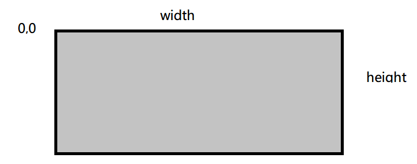 |
| **setFont(Font** 对象)                 | 设置字符的字体                                               |
| **drawString(”字符串",x **位置,y 位置) | 画一个字符串                                                 |
| **drawLine(x1,y1,x2,y2)**              | 指定起点和终点画一条线       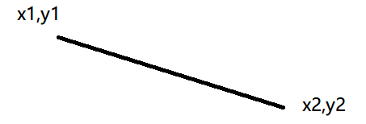   |

## 7.3 实现原理

- 验证码就是一张图片，验证码图片不是真实的资源图片而是缓存图片，图片的数据在缓存里面或内存里面， 将内存中的缓存图片输出到浏览器上。

## 7.4 实现步骤

1. 写一个方法随机获取颜色
2.  创建缓存图片：指定宽width=90，高 height=30
3.  获取画笔对象
4. 设置画笔颜色，并且填充矩形区域
5. 从字符数组中随机得到字符 `char[] arr = { 'A', 'B', 'C', 'D', 'N', 'E', 'W', 'b', 'o', 'y', '1', '2', '3', '4' }`;
6.  设置字体，大小为 18，设置字的颜色随机
7. 将每个字符画到图片上，位置：`5+(i*20), 20`
8. 画10条干扰线，线的位置是随机的，x 范围在 width 之中，y 的范围在 height 之中。
9. 将缓存的图片输出到响应输出流中

## 7.5 代码实现

```java
// 生成一张验证码图片
@WebServlet(urlPatterns = "/code")
public class CodeServlet extends HttpServlet {

    // 返回一个随机色对象
    public Color randomColor(){
        Random r = new Random();
        return new Color(r.nextInt(256),r.nextInt(256),r.nextInt(256));
    }

    protected void doPost(HttpServletRequest request, HttpServletResponse response) throws ServletException, IOException {
        // 1. 写一个方法随机获取颜色
        // 2. 创建缓存图片：指定宽width=90，高 height=30
        int width = 90;
        int height = 30;
        BufferedImage image = new BufferedImage(width,height,BufferedImage.TYPE_INT_RGB);
        // 3. 获取画笔对象
        Graphics g = image.getGraphics();
        // 4. 设置画笔颜色，并且填充矩形区域
        g.setColor(Color.white);
        // 填充矩形区域
        g.fillRect(0, 0, width, height);

        // 5. 从字符数组中随机得到字符
        char[] arr = { 'A', 'B', 'C', 'D', 'N', 'E', 'W', 'b', 'o', 'y', '1', '2', '3', '4'};

        // 创建随机数对象
        Random r = new Random();
        // 随机获得四个字符
        for (int i = 0; i < 4; i++) {
            // 获得随机数
            int index = r.nextInt(arr.length);
            // 获得要绘制的字符
            char c = arr[index];
            // 6. 设置字体，大小为 18，设置字的颜色随机
            g.setFont(new Font(Font.DIALOG,Font.BOLD+Font.ITALIC,18));

            // 设置字体颜色
            g.setColor(randomColor());

            // 7. 将每个字符画到图片上，位置：5+(i*20), 20
            g.drawString(String.valueOf(c), 5+(i*20), 20);
        }
        // 8. 画10条干扰线，线的位置是随机的，x 范围在 width 之中，y 的范围在 height 之中。
        for (int i = 0; i < 10; i++) {
            // 设置起点的坐标
            int x1 = r.nextInt(width);
            int y1 = r.nextInt(height);

            // 设置终点的坐标
            int x2 = r.nextInt(width);
            int y2 = r.nextInt(height);

            // 设置字体颜色
            g.setColor(randomColor());

            // 绘制干扰先
            g.drawLine(x1 , y1,x2 ,y2 );
        }
        // 9. 将缓存的图片输出到响应输出流中
        ImageIO.write(image, "png", response.getOutputStream());

    }

    protected void doGet(HttpServletRequest request, HttpServletResponse response) throws ServletException, IOException {
        this.doPost(request, response);
    }
}
```

## 7.6 显示验证码页面

```html
<!DOCTYPE html>
<html lang="zh-CN">
  <head>
    <meta charset="utf-8">
    <meta http-equiv="X-UA-Compatible" content="IE=edge">
    <meta name="viewport" content="width=device-width, initial-scale=1">
    <title>登录页面</title>
    <link href="css/bootstrap.min.css" rel="stylesheet">
    <script src="js/jquery-3.2.1.min.js"></script>
    <script src="js/bootstrap.min.js"></script>
  </head>
  <body>
    <div class="container" style="max-width:400px">
	    <h3 style="text-align: center">用户登录</h3>
	    <form action="login" method="post" >
	    	<div class="form-group">
	    		<label for="name">用户名：</label>
	    		<input type="text" name="name" class="form-control" id="name" placeholder="请输入用户名">
	    	</div>
	    	<div class="form-group">
	    		<label for="password">密码：</label>
	    		<input type="password" name="password" class="form-control" id="password" placeholder="请输入密码"/>
	    	</div>
			<div class="form-inline">e
	    		<label for="vcode">验证码：</label>
	    		<input type="text" name="vcode" class="form-control" id="vcode" placeholder="验证码" style="width: 70px" maxlength="4"/>&nbsp;
				<!--code就是servlet访问路径-->
				
	    	</div>
	    	<div style="text-align: center; padding-top: 20px;">
		    	<input type="submit" value=" 登 录 " class="btn btn-primary"/>
	    	</div>
	    </form>
	    </div>
  </body>

	<script>
		document.getElementById("codeImage").onclick = function () {
			this.src = "code?t="+new Date().getTime();
        }
	</script>
</html>
```

